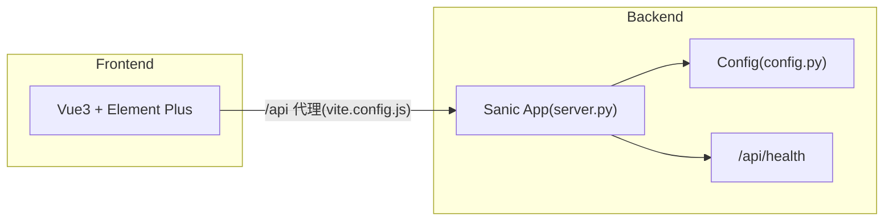

# StoneVault（磐石 Vault）架构

## 概述

StoneVault 是一个运行于 RK3566（四核 A55、2GB RAM、16GB eMMC）的内网智能备份中枢，采用"SSD 热区 + HDD 冷区"双存储架构，将多终端文件自动备份至外接机械硬盘，同时提供在线预览、多维度查询与源文件按需恢复能力。

系统当前处于第一阶段（MVP）开发中，已完成后端/前端工程骨架、配置加载与健康检查接口，后续将按实施计划逐步实现备份引擎、数据库、查询与预览等模块。

## 技术栈

**语言与运行时**
- Python 3.11（后端）
- JavaScript（前端，Node 22）

**框架**
- Sanic 23.12（后端 Web 框架）
- Vue 3 + Vite 5 + Element Plus 2.7（前端）
- Vue Router 4（前端路由）

**数据存储**
- SQLite（WAL 模式，`backend/app/schema.py` + `database.py`）
- FTS5 全文索引（外部内容表 + `trigram` 分词器）

**测试**
- pytest + pytest-asyncio
- sanic-testing（Sanic 测试客户端）
- httpx

**外部工具（规划）**
- FFmpeg（音视频转码）
- PaddleOCR / Vosk（AI 深度索引）

## 项目结构

```
project-root/
├── backend/                    # 后端服务（Sanic）
│   ├── app/
│   │   ├── __init__.py
│   │   ├── config.py           # 配置加载（热区/冷区路径、并发上限等）
│   │   ├── database.py         # SQLite 连接与 WAL 初始化
│   │   ├── schema.py           # 表结构与版本化 DDL
│   │   ├── repositories.py     # 数据访问层（各表 CRUD 仓储）
│   │   ├── server.py           # Sanic 应用入口与健康检查
│   │   ├── backup_engine/      # 备份引擎（规划）
│   │   ├── scheduler/          # 任务调度器（规划）
│   │   ├── indexer/            # 文件索引（规划）
│   │   ├── query_service/      # 查询服务（规划）
│   │   ├── preview_service/    # 在线预览（规划）
│   │   ├── transcode_worker/   # 音视频转码（规划）
│   │   ├── ai_indexer/         # AI 深度索引（规划）
│   │   ├── wake_manager/       # HDD 唤醒管理（规划）
│   │   ├── auth/               # 管理员认证（密码散列、会话、中间件）
│   │   │   ├── passwords.py    # PBKDF2-SHA256 带盐散列
│   │   │   ├── sessions.py     # HMAC 签名会话令牌
│   │   │   └── middleware.py   # 请求认证中间件
│   │   └── api/                # REST API 蓝图
│   │       └── auth.py         # 登录/登出接口
│   ├── tests/                  # pytest 测试
│   ├── requirements.txt
│   └── pytest.ini
├── frontend/                   # 前端管理界面（Vue 3）
│   ├── src/
│   │   ├── main.js             # 应用入口
│   │   └── App.vue             # 根组件
│   ├── vite.config.js          # Vite 配置（/api 代理、allowedHosts）
│   ├── package.json
│   └── index.html
└── start.sh                    # 同时启动前后端的脚本
```

**入口点**
- `backend/app/server.py` - Sanic 应用创建与启动
- `frontend/src/main.js` - 前端应用挂载
- `start.sh` - 一键启动前后端

## 子系统

### 配置模块
**目的**: 集中管理热区/冷区路径、服务端口、并发上限与硬盘唤醒参数，支持环境变量覆盖。
**位置**: `backend/app/config.py`
**关键文件**: `config.py`
**依赖**: Python 标准库（dataclass、pathlib）
**被依赖**: `server.py`、各业务模块

### HTTP 应用层
**目的**: 创建 Sanic 应用，暴露健康检查接口，为后续 API 蓝图提供宿主。
**位置**: `backend/app/server.py`
**关键文件**: `server.py`
**依赖**: `config.py`
**被依赖**: `tests/test_smoke.py`

### 前端应用
**目的**: 提供内网管理界面骨架，包含 Element Plus 布局与 `/api` 反向代理。
**位置**: `frontend/src/`
**关键文件**: `main.js`、`App.vue`、`vite.config.js`
**依赖**: Vue 3、Element Plus、Vite

## 图表



## 当前开发状态

- [x] 任务 1：项目结构与核心接口
- [x] 任务 2：数据库初始化与数据模型（SQLite WAL、7 张核心表、FTS5、仓储层）
- [x] 任务 3：管理员认证（PBKDF2 密码散列、HMAC 会话令牌、认证中间件）
- [ ] 任务 4+：备份引擎等（见实施计划 `tasklist.md`）
