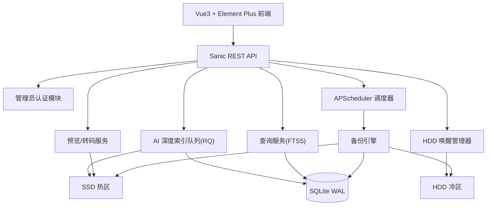
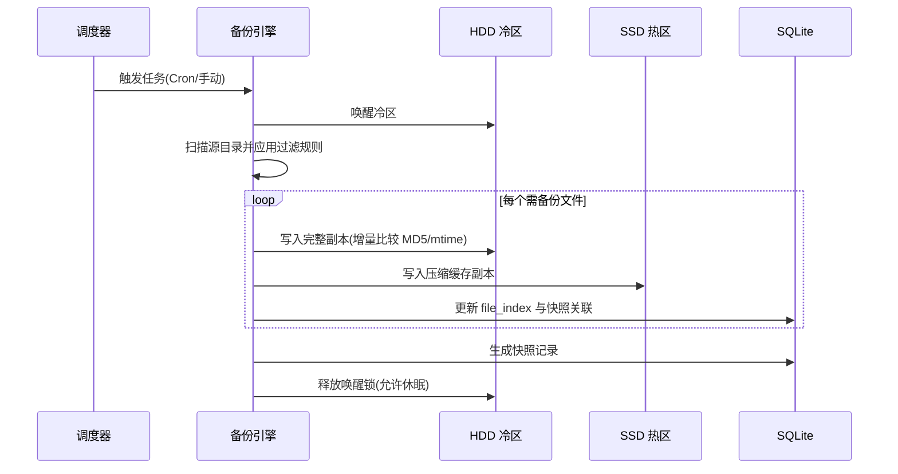
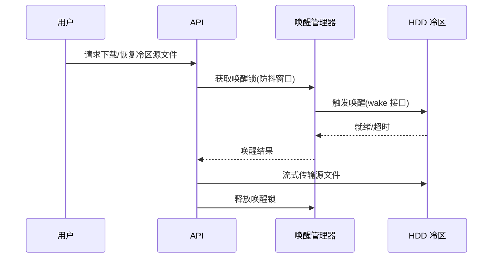

# 设计文档：RK3566 智能内网备份中枢

Feature Name: 2026-08-02-rk3566-intranet-backup
Updated: 2026-08-02

## Description

本系统运行于 RK3566（四核 A55、2GB RAM、16GB eMMC），采用"SSD 热区 + HDD 冷区"双存储架构，提供内网多终端文件的自动备份、在线预览、多维度查询（含全文检索与 AI 内容识别）与源文件按需恢复能力。

已确认的设计决策：
1. **认证**：单管理员账号登录，密码单向散列存储。
2. **深度索引**：默认自动在凌晨空闲时段执行，同时支持手动触发；AI 任务并发上限 2 进程。
3. **音视频转码**：优先使用 RK3566 VPU 硬解码（rkmpp），ffmpeg 软解码保底。

## Architecture

### 分层说明

- **前端层**：Vue3 + Element Plus 单页应用，通过 REST API 与管理端交互，内网浏览器直接访问。
- **接口层**：Sanic（异步轻量框架）暴露 REST 端点，统一前置管理员认证与请求校验。
- **服务层**：备份引擎、任务调度器、查询服务、预览/转码服务、AI 深度索引、HDD 唤醒管理器。
- **存储层**：SQLite（WAL 模式，位于热区）承载结构化数据与 FTS5 全文索引；SSD 热区存放缓存副本与缩略图；HDD 冷区存放原始文件完整副本。

### 备份流程

### HDD 按需唤醒（防抖）

## Components and Interfaces

### 组件职责

| 组件 | 职责 | 关键技术 |
| :--- | :--- | :--- |
| `backup_engine` | 执行任务扫描、过滤、增量比较、HDD/SSD 双写 | Python `rsync` 式增量逻辑 |
| `scheduler` | Cron 触发、错峰限速、HDD 电源调度 | APScheduler |
| `indexer` | 生成 file_index、更新 FTS5、管理快照 | SQLite FTS5 |
| `query_service` | 文件名/后缀/时间/大小/全文组合查询 | SQLite FTS5 `MATCH` |
| `preview_service` | 图片缩略图、PDF/TXT 渲染、音视频转码 | PIL、PDF.js、FFmpeg |
| `transcode_worker` | 音视频硬解码（rkmpp）优先转码为 HLS/MP4 分段，软解回退 | FFmpeg + Rockchip MPP |
| `ai_indexer` | 低优先级深度索引（OCR/ASR），并发上限 2 | RQ、PaddleOCR、Vosk |
| `wake_manager` | 冷区唤醒/休眠、防抖合并、超时重试 | 文件流触发 + 异步队列 |
| `auth` | 管理员登录、会话签发与校验、密码散列 | `argon2`/`bcrypt` 单侧散列 |

### REST 接口

| 方法 | 路径 | 说明 |
| :--- | :--- | :--- |
| POST | `/api/auth/login` | 管理员登录，签发会话 |
| POST | `/api/auth/logout` | 注销会话 |
| GET/POST/PUT/DELETE | `/api/tasks` | 备份任务增删改查 |
| POST | `/api/tasks/{id}/run` | 手动触发任务 |
| GET | `/api/tasks/{id}/logs` | 任务执行日志 |
| GET | `/api/snapshots` | 快照历史列表 |
| GET | `/api/files?q=&ext=&from=&to=&size_min=&size_max=` | 文件组合查询 |
| GET | `/api/files/{id}/preview` | 在线预览（图片/PDF/TXT） |
| GET | `/api/files/{id}/stream` | 音视频转码流 |
| GET | `/api/files/{id}/download` | 源文件下载（触发 HDD 唤醒） |
| POST | `/api/index/deep` | 手动触发深度索引 |
| GET | `/api/system/status` | HDD/SSD 状态、内存、队列深度 |

## Data Models

### tasks

| 字段 | 类型 | 说明 |
| :--- | :--- | :--- |
| id | INTEGER PK | 任务 ID |
| name | TEXT | 任务名称 |
| source_path | TEXT | 源目录路径 |
| hdd_rel_path | TEXT | 冷区目标相对路径 |
| schedule_cron | TEXT | Cron 表达式，可空（仅手动） |
| filter_extensions | TEXT JSON | 后缀白/黑名单 |
| filter_min_size / filter_max_size | INTEGER | 大小过滤（字节） |
| backup_mode | TEXT | `full` / `incremental` |
| enabled | INTEGER | 是否启用 |
| created_at / updated_at | TEXT | 时间戳 |

### snapshots

| 字段 | 类型 | 说明 |
| :--- | :--- | :--- |
| id | INTEGER PK | 快照 ID |
| task_id | INTEGER FK | 关联任务 |
| started_at / finished_at | TEXT | 起止时间 |
| status | TEXT | `pending` / `running` / `success` / `failed` / `skipped` |
| file_count | INTEGER | 处理文件数 |
| total_bytes | INTEGER | 总数据量 |
| error_message | TEXT | 失败原因 |

### file_index

| 字段 | 类型 | 说明 |
| :--- | :--- | :--- |
| id | INTEGER PK | 文件 ID |
| snapshot_id | INTEGER FK | 最近快照 |
| rel_path | TEXT | 备份相对路径 |
| file_size | INTEGER | 文件大小 |
| md5 | TEXT | 内容校验值 |
| mtime | TEXT | 源文件修改时间 |
| ssd_cache_path | TEXT | 热区压缩副本路径 |
| hdd_source_path | TEXT | 冷区源文件路径 |
| content_type | TEXT | MIME 类型 |

### file_fts（FTS5 虚拟表）

| 列 | 说明 |
| :--- | :--- |
| filename | 文件名（用于高亮） |
| body | 提取的文档正文（Word/PDF/TXT） |
| ai_text | OCR / 语音转写识别文本 |

`rowid` 关联 `file_index.id`；FTS5 使用 `contentless` 外部内容表模式以节省热区空间。

### metadata（预留扩展）

| 字段 | 类型 | 说明 |
| :--- | :--- | :--- |
| id | INTEGER PK | 元数据 ID |
| file_id | INTEGER FK | 关联文件 |
| kind | TEXT | `exif` / `video_duration` / `audio_sample_rate` |
| value_json | TEXT | 结构化元数据 |

### admin_user

| 字段 | 类型 | 说明 |
| :--- | :--- | :--- |
| id | INTEGER PK | 用户 ID |
| username | TEXT UNIQUE | 用户名 |
| password_hash | TEXT | 单向散列（含盐） |

### ai_jobs（深度索引队列）

| 字段 | 类型 | 说明 |
| :--- | :--- | :--- |
| id | INTEGER PK | 任务 ID |
| file_id | INTEGER FK | 关联文件 |
| job_type | TEXT | `ocr` / `asr` / `detect` |
| status | TEXT | `pending` / `running` / `done` / `failed` |
| priority | INTEGER | 低优先级 |
| created_at | TEXT | 入队时间 |

## Correctness Properties

1. **双写原子性**：源文件完整副本先写入冷区并校验 MD5 成功后，再写入热区压缩副本与索引记录；任一步失败则该文件标记为失败并记录，不产生半写入索引。
2. **增量正确性**：增量备份以 `file_index` 中最近快照的 `md5`+`mtime` 为基准，变更或新增文件才进入传输集合。
3. **唤醒互斥**：`wake_manager` 持有全局唤醒锁，同一防抖窗口内并发冷区请求共享同一次唤醒，锁释放后才允许休眠。
4. **并发上限**：AI 深度索引进程数在任何时刻不超过 2，转码进程数不超过 1，防止 2GB 内存 OOM。
5. **查询一致性**：SQLite 以 WAL 模式运行，读写并发不阻塞；FTS5 与 `file_index` 在同一事务内更新，避免索引不一致。
6. **幂等触发**：手动触发与 Cron 触发共享同一任务执行锁，重复触发被合并为单次执行。

## Error Handling

| 场景 | 处理策略 |
| :--- | :--- |
| 冷区离线/未挂载 | 备份任务暂停并置为 `failed`，前端展示冷区离线告警；下载接口返回友好提示 |
| 唤醒超时 | 重试 2 次后返回友好提示，不静默失败 |
| 冷区磁盘空间不足 | 完成当前文件后终止任务，记录 `error_message` 并告警 |
| 内存压力（2GB） | 推迟低优先级 AI 任务，内存回落后续跑；转码/索引大文件使用流式分块 |
| 转码硬解失败 | 自动回退 ffmpeg 软件解码 |
| 备份中断 | 支持断点续传；失败文件进入可重试列表，提供手动重试入口 |
| 会话过期 | 管理接口返回 401，前端跳转登录页 |

## Test Strategy

1. **单元测试**：文件过滤规则（后缀/大小边界）、增量差异计算（mtime/MD5 变化）、FTS5 查询与高亮、密码散列与登录鉴权。
2. **集成测试**：以临时目录模拟 SSD/HDD 分离挂载，验证双写顺序、快照生成、唤醒防抖合并与超时重试。
3. **并发测试**：多任务并发、AI 进程上限约束、SQLite WAL 读写并发下的数据一致性。
4. **硬件验证清单（RK3566 实机）**：NPU 上运行 PaddleOCR RKNN 模型、rkmpp 硬解码 H.264/H.265、2GB 内存压力下的长期运行稳定性、HDD 休眠功耗实测。
5. **端到端测试**：创建任务 → 定时备份 → 在线预览 → 全文检索命中 → 源文件按需下载的完整链路。

## 阶段性范围说明

- **第一阶段（MVP）**：认证、任务管理、备份双写、`file_index` 索引、文件名/后缀/时间查询、任务日志与告警。
- **第二阶段**：在线预览（图片/PDF/TXT）、FTS5 全文检索与高亮、HDD 按需唤醒下载接口、音视频转码流。
- **第三阶段**：NPU OCR、Vosk 语音转写、目标检测（可选）、2GB 内存深度优化与空间清理策略。

## References

[^1]: requirements.md - [需求文档](requirements.md)
